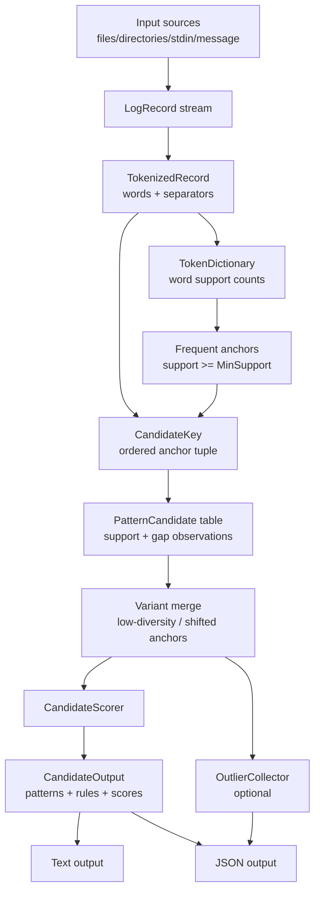
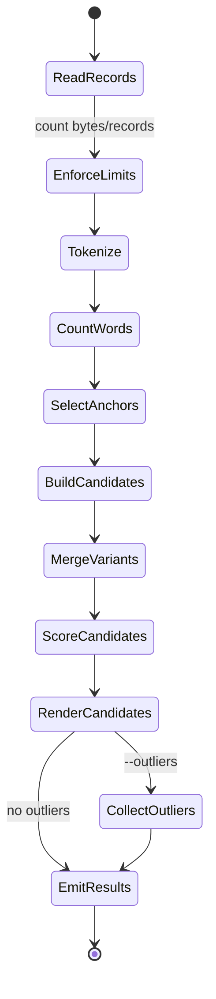
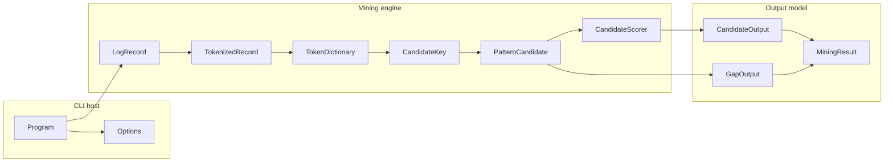
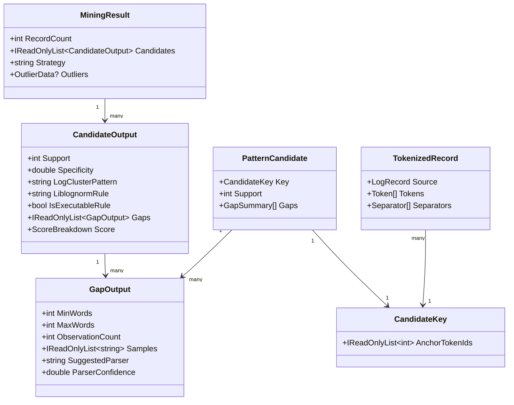
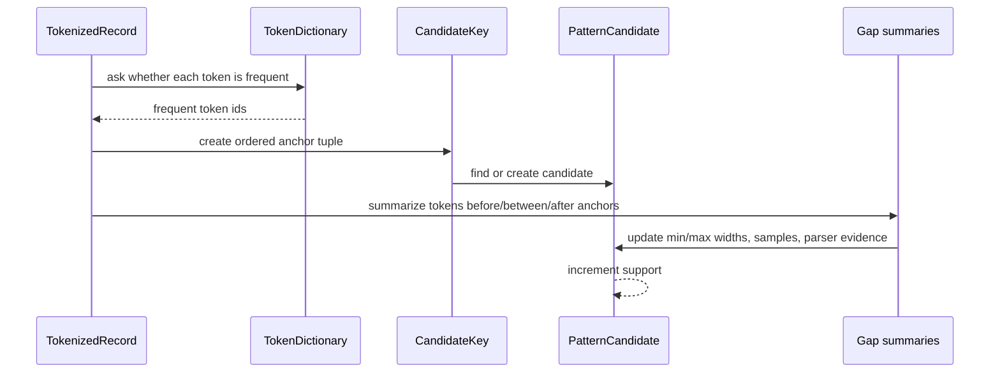
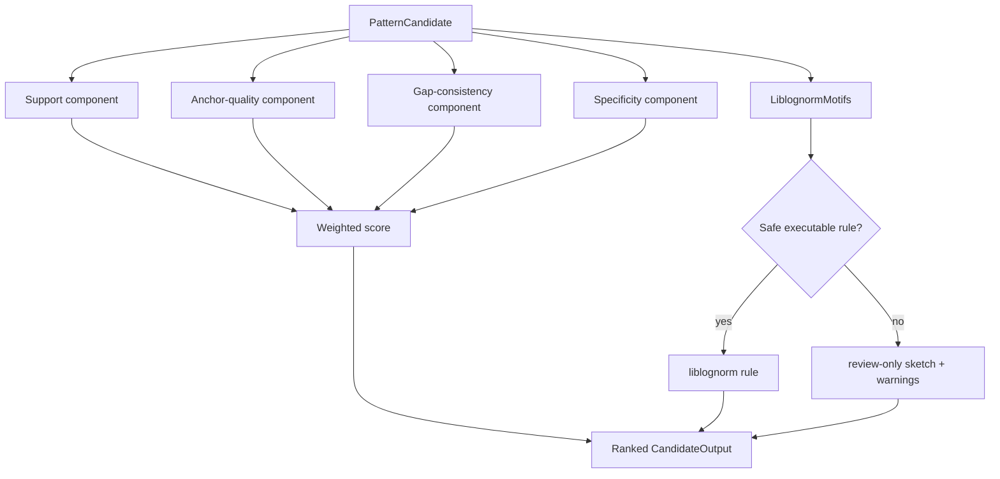
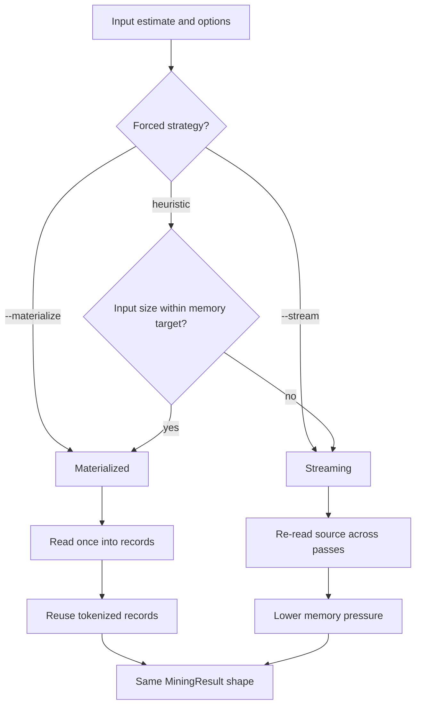

# Architecture

DeltaZulu.LogCluster is a C# implementation of LogCluster-style event-log mining for DeltaZulu.Platform parser suggestion. This page summarizes the data structures and algorithmic aspects described in the LogCluster academic papers, then maps those ideas to the internal .NET pipeline.

## Academic algorithm summary

The LogCluster papers frame event-log template discovery as an unsupervised clustering and pattern-mining problem for textual log lines. The user supplies a support threshold `s`, and the algorithm searches for line patterns that occur in at least `s` records while also identifying lines that do not belong to any frequent cluster.

### Relationship to SLCT

LogCluster extends the earlier SLCT family of algorithms. SLCT identifies frequent words with their positions, builds cluster candidates from those position-aware frequent words, and selects candidates whose support reaches the threshold. The LogCluster papers describe two key limitations of the position-aware approach:

* similar messages can be split when fixed words shift to different positions,
* delimiter noise can move words and reduce clustering quality, and
* low support thresholds can overfit by producing overly specific patterns.

LogCluster keeps the useful support-threshold and frequent-word concepts, but removes fixed positional encoding from candidate identity. Frequent words are retained in their original order within each line, and variable regions between them are summarized as wildcard gaps such as `*{1,2}`.

### Data structures highlighted by the papers

The Perl LogCluster and C LogClusterC work emphasize compact, pass-oriented data structures:

* **Word frequency table** - counts tokens during the first pass so words whose support is at least `s` can become anchors.
* **Frequent-word tuple** - represents a candidate by the ordered frequent words extracted from a line, without binding those words to absolute positions.
* **Candidate table** - maps each tuple to support and summary state for all lines assigned to the candidate.
* **Gap summaries** - store aggregate information about infrequent words before, between, and after frequent words, allowing patterns such as `User *{1,2} login from *{1,1}`.
* **Outlier set or pass** - reports lines that are not explained by any selected cluster.
* **Hash-based acceleration** - LogClusterC discusses reusing fast hashing, sketches, and move-to-front hash-table ideas from SLCT to reduce memory and CPU overhead in C.

DeltaZulu.LogCluster mirrors the logical structures above with idiomatic .NET types: `TokenDictionary`, `TokenizedRecord`, `CandidateKey`, `PatternCandidate`, `GapOutput`, `CandidateOutput`, and `MiningResult`. It does not vendor the Perl or C implementations.

### Algorithmic passes

The academic algorithm can be summarized as a small number of passes over the event log:

1. **Tokenize and count words** - split log lines into words and identify frequent words using support threshold `s`.
2. **Build candidates** - for each line, extract its frequent words, keep them in observed order, and use the ordered tuple as the candidate identity.
3. **Maintain summaries** - increment candidate support and update wildcard/gap summaries for infrequent material surrounding anchors.
4. **Select clusters** - keep only candidates whose support reaches `s`.
5. **Render patterns** - emit line patterns that combine anchors with wildcard gap bounds.
6. **Report outliers** - optionally identify lines not covered by selected clusters.

DeltaZulu.LogCluster adds scoring, parser motif detection, JSON output, rule safety flags, and materialized/streaming execution choices around those core steps.

## Internal pipeline overview

The command-line host is deliberately thin. It resolves input sources and options, then delegates mining to reusable pipeline types so the same engine can be embedded in DeltaZulu.Platform components.

## Activity view

This activity view corresponds to the academic pass model, with additional production safeguards for limits, scoring, rendering, and optional outlier collection.

## Responsibility view

## Core data model

The runtime code may expose additional fields, but this diagram captures the architectural contracts: tokenized records produce candidate keys, candidates accumulate support and gaps, and output objects preserve enough context for review and automation.

## Data structures in DeltaZulu.LogCluster

| Academic concept | DeltaZulu.LogCluster role | Design note |
| --- | --- | --- |
| Support threshold `s` | `MinSupport` option | Controls both anchor eligibility and candidate survival. |
| Frequent word table | `TokenDictionary` and support counts | Stable anchors are selected before candidate construction. |
| Ordered frequent-word tuple | `CandidateKey` | Candidate identity uses anchor order rather than absolute word positions. |
| Candidate table | `PatternCandidate` collection | Stores support and variable-region observations for each key. |
| Wildcard gap summaries | Gap summaries rendered as `GapOutput` | Tracks min/max width, samples, parser motif, and confidence. |
| Selected clusters | `CandidateOutput` | Adds score, executable-rule flag, warnings, and text/JSON renderings. |
| Outliers | `OutlierCollector` output | Optional because outlier review is useful during source triage but can be expensive. |

## Candidate construction and gap handling

The important LogCluster distinction is that the key is an ordered tuple of frequent anchors. Gaps are not arbitrary regular expressions; they are observed summaries of the infrequent token regions seen in records assigned to the same candidate.

## Scoring and rule rendering additions

The academic papers focus on finding clusters and rendering line patterns. DeltaZulu.LogCluster adds ranking and parser-suggestion context because the platform use case needs reviewable parser candidates rather than only discovered templates.

The rule renderer is intentionally conservative. Single-token gaps can become specific parsers such as `word` or `ipv4` when samples support that choice. Multi-word gaps are only rendered as `rest` when doing so will not consume later anchors; otherwise the output remains a structural sketch with warnings.

## Materialized versus streaming execution

The academic algorithm is naturally pass-oriented, which makes both execution strategies valid. Materialization is faster for typical corpora, while streaming preserves the pass structure and reduces memory pressure for large inputs.

## References and acknowledgement

DeltaZulu.LogCluster acknowledges the LogCluster project and related research by Risto Vaarandi and collaborators, plus the LogClusterC implementation used to study a C version of the algorithm. These works provide the historical context for frequent-word candidate generation, wildcard gap notation, outlier mining, and event-log applications.

* [LogCluster project page](https://ristov.github.io/logcluster/)
* [ristov/logcluster](https://github.com/ristov/logcluster)
* [zhugegy/LogClusterC](https://github.com/zhugegy/LogClusterC)
* [LogCluster - A data clustering and pattern mining algorithm for event logs](https://researchr.org/publication/VaarandiP15)
* [Efficient Event Log Mining with LogClusterC](https://ristov.github.io/publications/ids17-logclusterc-web.pdf)
